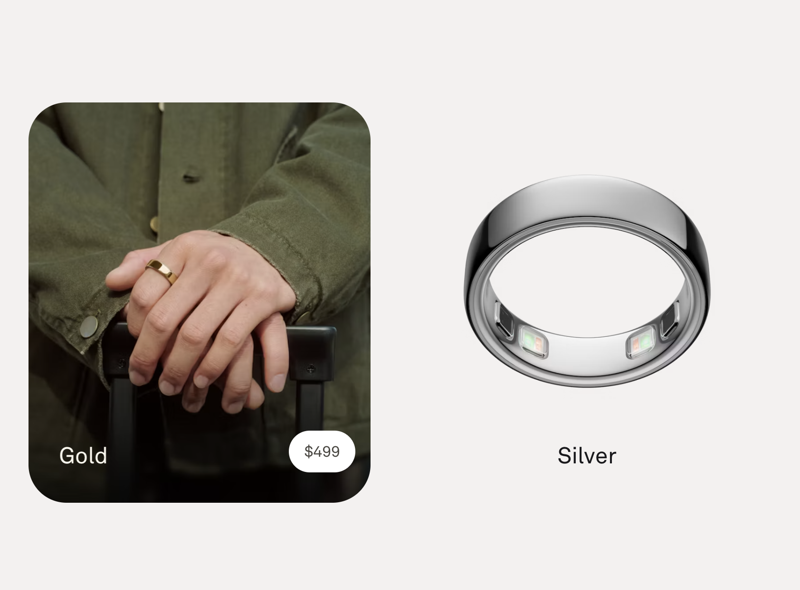
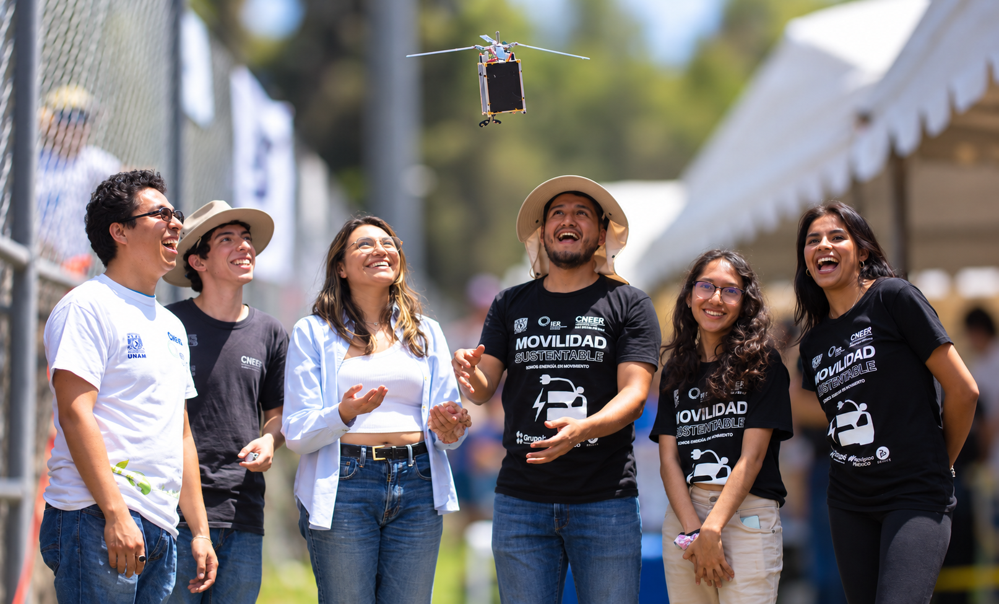

## {.portada background-gradient="linear-gradient(135deg, #0b2545 0%, #13315c 55%, #1b998b 100%)"}

::: {.evento}
CNEER 2026 · Conferencia
:::

::: {.titulo}
Tendencias de la IA en la gestión energética de edificios
:::

::: {.subtitulo}
Gemelos digitales, control inteligente y agentes
:::

::: {.autor}
**Dr. Guillermo Barrios del Valle** 
Instituto de Energías Renovables, UNAM 
gbv@ier.unam.mx
:::

## La energía se gana diseñando y operando

::: {.definicion}
Los edificios consumen cerca de **un tercio de la energía mundial**; en el México cálido, el aire acondicionado domina el consumo y crece con cada ola de calor.
:::

:::: {.columns}

::: {.column width="33%"}
::: {.cifra}
[17–24 %]{.numero}
[menos HVAC con control por ocupación, medido en campo]{.texto}
:::
:::

::: {.column width="33%"}
::: {.cifra}
[24–58 %]{.numero}
[de ahorro de HVAC en hoteles, según sensor y clima]{.texto}
:::
:::

::: {.column width="33%"}
::: {.cifra}
[22–50 %]{.numero}
[menos electricidad y gas en oficinas pequeñas]{.texto}
:::
:::

::::

::: {.idea}
La IA ayuda en ambos frentes: **diseño bioclimático** y **operación**. Esta charla se enfoca en operar.
:::

::: {.fuente}
Jung & Jazizadeh, *Building and Environment* (2019) · estudios LSU/PNNL de controles ocupante-céntricos · estudio experimental lado a lado (2023)
:::

<!--
## ¿Qué es un gemelo digital?

::: {.definicion}
Réplica **virtual** de un sistema físico —un edificio— que se mantiene **sincronizada con datos medidos** y permite **simular, predecir y optimizar** su comportamiento.
:::

:::: {.columns}

::: {.column width="33%"}
::: {.concepto}
#### Objeto físico
El edificio real: envolvente, clima, ocupación y sus sistemas (HVAC, iluminación).
:::
:::

::: {.column width="33%"}
::: {.concepto}
#### Modelo virtual
Modelo térmico-energético calibrado: EnergyPlus, caja gris o aprendizaje automático.
:::
:::

::: {.column width="33%"}
::: {.concepto}
#### Flujo de datos
Sensores y BMS actualizan el modelo; el modelo retroalimenta la operación.
:::
:::

::::

::: {.idea}
No es un render 3D ni una simulación estática: **vive y se actualiza** con el edificio.
:::
-->

## Simulación, sombra digital y gemelo digital

::: {.definicion}
La diferencia está en el **flujo de datos** entre el sistema físico y su modelo virtual.
:::

:::: {.columns}

::: {.column width="33%"}
::: {.concepto}
#### Simulación

::: {.flujo}
[Físico]{.nodo} [⇢]{.manual} [Virtual]{.nodo}
:::

Evalúa escenarios con datos de entrada fijos; toda actualización es **manual**.
:::
:::

::: {.column width="33%"}
::: {.concepto}
#### Sombra digital

::: {.flujo}
[Físico]{.nodo} [→]{.auto} [Virtual]{.nodo}
:::

Los datos medidos actualizan el modelo **automáticamente**, pero este no actúa sobre el edificio.
:::
:::

::: {.column width="33%"}
::: {.concepto .destacado}
#### Gemelo digital

::: {.flujo}
[Físico]{.nodo} [⇄]{.auto} [Virtual]{.nodo}
:::

Flujo **bidireccional y automático**: el modelo retroalimenta la operación del edificio.
:::
:::

::::

::: {.idea}
Solo hay gemelo digital cuando el modelo **actúa de vuelta** sobre el sistema físico.
:::

<!--
## ¿Qué es un agente?

::: {.definicion}
Sistema de IA que **percibe** su entorno, **razona** sobre un objetivo y **actúa** de forma autónoma usando herramientas.
:::

:::: {.columns}

::: {.column width="33%"}
::: {.concepto}
#### 1 · Percibe
Lee sensores, clima, tarifas eléctricas y ocupación en tiempo real.
:::
:::

::: {.column width="33%"}
::: {.concepto}
#### 2 · Razona
Planifica con LLM o control óptimo para cumplir metas de confort y energía.
:::
:::

::: {.column width="33%"}
::: {.concepto}
#### 3 · Actúa
Ajusta consignas, acciona equipos y evalúa escenarios en el gemelo digital.
:::
:::

::::

::: {.idea}
Juntos: el gemelo digital es el **campo de pruebas**; el agente, el **operador autónomo**.
:::
-->

## Un agente que ya conoces

::: {.definicion}
Cada vez que ChatGPT o Claude **busca en la web, ejecuta código o lee un archivo** por ti, estás usando un agente. El mecanismo detrás se llama **tool calling**.
:::

::: {.flujo}
[Petición]{.nodo} [→]{.auto} [LLM]{.nodo} [→]{.auto} [Herramienta]{.nodo} [→]{.auto} [LLM]{.nodo} [→]{.auto} [Respuesta]{.nodo}
:::

:::: {.columns}

::: {.column width="33%"}
::: {.concepto}
#### 1 · Pide, no ejecuta
El LLM emite una llamada estructurada (JSON): qué herramienta necesita y con qué argumentos.
:::
:::

::: {.column width="33%"}
::: {.concepto}
#### 2 · Algo determinista ejecuta
Un programa corre la herramienta —con permisos y límites— y devuelve el resultado.
:::
:::

::: {.column width="33%"}
::: {.concepto}
#### 3 · El LLM cierra el lazo
Interpreta el resultado y decide el siguiente paso, o redacta la respuesta final.
:::
:::

::::

::: {.idea}
Recuerden este patrón: **el LLM decide, un sistema determinista ejecuta**. Así también se opera un edificio.
:::

## ¿Qué es un wearable?

::: {.definicion}
Sensores **vestibles** que miden fisiología continua sin interrumpir a la persona. El ejemplo que quizá ya conocen: **Oura**.
:::

:::: {.columns}

::: {.column width="42%"}
{.foto fig-alt="Anillo Oura: versión Gold en la mano ($499) y versión Silver mostrando los sensores internos"}
:::

::: {.column width="58%"}
::: {.concepto .compacto}
#### Qué mide
Temperatura de piel **cada minuto** (0.13 °C), FC, HRV y SpO₂ — desde el dedo.
:::

::: {.concepto .compacto .destacado}
#### Por qué nos importa
Justo las variables que piden los modelos de confort térmico personal.
:::

::: {.concepto .compacto}
#### El problema
**349–499 USD + suscripción**; los datos crudos viven en la nube del fabricante.
:::
:::

::::

::: {.idea}
Medir el confort desde el cuerpo **ya es tecnología de consumo**. Falta hacerla abierta y barata.
:::

::: {.fuente}
Validación del fabricante: 92 % de acuerdo con un sensor de investigación en uso real · imagen: ouraring.com
:::

## El reto: barato, exacto y libre

::: {.definicion}
El lazo —wearable + agente + gemelo operando el edificio— **ya existe en la literatura**. Llevarlo a nuestras aulas y viviendas exige que cada pieza cumpla tres condiciones a la vez.
:::

:::: {.columns}

::: {.column width="33%"}
::: {.concepto}
#### Barato
Cientos de pesos por nodo, no decenas de miles: que un grupo, una escuela o una vivienda pueda tener varios.
:::
:::

::: {.column width="33%"}
::: {.concepto}
#### Exacto
Sensores calibrados contra una referencia y deriva controlada: datos que resisten la revisión por pares.
:::
:::

::: {.column width="33%"}
::: {.concepto .destacado}
#### Libre
Poder usar, estudiar, modificar y compartir cada pieza — sin suscripciones ni nubes ajenas.
:::
:::

::::

::: {.idea}
El resto de la charla: construir este lazo **sobre la mesa**, con hardware de cientos de pesos y un LLM local.
:::

## ¿Qué es el software libre?

::: {.definicion}
Software cuya licencia garantiza **cuatro libertades**: usarlo, estudiarlo, modificarlo y compartirlo. El código fuente es público y la comunidad lo audita y lo mejora.
:::

:::: {.columns}

::: {.column width="33%"}
::: {.concepto}
#### Ya lo usas a diario
Linux (servidores, Android), Firefox, Python, R. La ciencia moderna corre sobre software libre.
:::
:::

::: {.column width="33%"}
::: {.concepto}
#### En esta charla
Ollama y los modelos abiertos, ESP-IDF y Arduino, Home Assistant, EnergyPlus — y Quarto, con el que está hecha esta presentación.
:::
:::

::: {.column width="33%"}
::: {.concepto .destacado}
#### Por qué importa aquí
Sin licencias por nodo ni nubes obligatorias: los datos y el control **se quedan en el edificio**.
:::
:::

::::

::: {.idea}
Libre no significa solo gratis: significa **control, transparencia y reproducibilidad**.
:::

## El ESP32: el cuerpo del agente

::: {.definicion}
Microcontrolador con Wi-Fi de **100–350 pesos**, el estándar de facto del IoT abierto. Con TinyML maduro, pone los **sentidos y las manos** del agente en el edificio.
:::

:::: {.columns}

::: {.column width="33%"}
::: {.concepto}
#### Sentidos
Temperatura y humedad (±0.2 °C), CO₂, presencia por radar mmWave, corriente eléctrica, vibración y sonido — sensores de decenas a cientos de pesos.
:::
:::

::: {.column width="33%"}
::: {.concepto}
#### Reflejos (TinyML)
Modelos de < 100 kB corriendo **dentro del chip**: ocupación, desagregación de consumo (NILM), detección de fallas de HVAC por vibración.
:::
:::

::: {.column width="33%"}
::: {.concepto}
#### Manos
Control IR del minisplit (casi cualquier marca), relés y actuadores — **siempre con límites deterministas en el firmware**.
:::
:::

::::

::: {.idea}
Un nodo completo de sensado + inferencia + actuación cuesta **menos que una visita técnica**.
:::

## Tres demos

[En vivo]{.insignia}

::: {.definicion}
Un ESP32 conectado por USB a esta laptop. Tres peldaños: de juguete a **operador del edificio**.
:::

:::: {.columns}

::: {.column width="33%"}
::: {.concepto}
#### 1 · Stories
Un transformer de 260 mil parámetros **generando cuentos dentro del chip**, a ~20 tokens por segundo. *Puede computar.*
:::
:::

::: {.column width="33%"}
::: {.concepto}
#### 2 · El barista
8.9 millones de parámetros, experto en espresso, **100 % offline** en el ESP32. *Puede saber de un dominio.*
:::
:::

::: {.column width="33%"}
::: {.concepto .destacado}
#### 3 · El operador de color
Un LLM local (Ollama) **enciende, apaga y colorea** el LED del ESP32 por tool calling; el firmware valida cada orden. *Puede operar.*
:::
:::

::::

::: {.idea}
La tercera es el patrón completo: **el LLM decide, el firmware ejecuta** — hoy un LED, mañana el minisplit. Vamos a la terminal →
:::

## Del anillo cerrado al reloj abierto

::: {.definicion}
Para investigar y controlar necesitamos lo que el anillo no da: **datos crudos, locales y baratos**.
:::

:::: {.columns}

::: {.column width="33%"}
::: {.concepto}
#### Cerrado
Oura, Whoop, Apple Watch: excelente fisiología, pero datos en la nube del fabricante y suscripciones.
:::
:::

::: {.column width="33%"}
::: {.concepto}
#### Intermedio
**Cozie**: app abierta de encuestas de confort que corre sobre Apple Watch y Fitbit.
:::
:::

::: {.column width="33%"}
::: {.concepto .destacado}
#### Abierto — hecho en el IER
Smartwatch en *HardwareX* 2025: XIAO ESP32C3, temperatura de piel + FC + encuestas horarias de confort. **49 USD, GPLv3.**
:::
:::

::::

::: {.idea}
Los modelos personales ahorran **~30 % de HVAC** (hasta 45 % en verano) — y el wearable transmite la *preferencia*, no la fisiología.
:::

::: {.fuente}
*HardwareX* 2025 (DOI 10.1016/j.ohx.2025.e00633) · Tartarini et al., *Indoor Air* (2022): F1 ≈ 0.78 con ~300 votos · pulsera de 3 puntos: 93.9 % para control HVAC (KIST)
:::

## La arquitectura para México

::: {.definicion}
Todas las piezas existen y son abiertas. Falta **ensamblarlas aquí**: con nuestros climas, nuestras tarifas y nuestra vivienda.
:::

::: {.flujo}
[Wearable abierto]{.nodo} [→]{.auto} [Nodos ESP32]{.nodo} [⇄]{.auto} [LLM local]{.nodo} [⇄]{.auto} [Gemelo digital]{.nodo} [→]{.auto} [HVAC]{.nodo}
:::

:::: {.columns}

::: {.column width="33%"}
::: {.concepto}
#### Datos abiertos
No hay conjuntos medidos de confort, consumo y ocupación en vivienda cálida mexicana. Quien los publique, define el campo.
:::
:::

::: {.column width="33%"}
::: {.concepto}
#### Voz en español
ESP-SR no tiene palabras de activación ni comandos en español de primera clase. Contribución directa a la comunidad global.
:::
:::

::: {.column width="33%"}
::: {.concepto}
#### Comunidad
No hay nodo mexicano en TinyML4D. Docencia con EnergyPlus/OpenStudio + hardware de cientos de pesos.
:::
:::

::::

::: {.idea}
**El LLM decide, el firmware valida, el ocupante manda.** · gbv@ier.unam.mx
:::

## ¿Cómo lo aprendemos?

::: {.definicion}
Programación, terminal, electrónica, datos, documentación, cultura libre: **habilidades especializadas que piden una motivación especial** — un posgrado… o un buen proyecto en equipo.
:::

{.foto width="55%" fig-align="center" fig-alt="Equipo de estudiantes en el concurso CanSat viendo descender su satélite"}

::: {.idea}
Un **CanSat** —construir, programar y lanzar un satélite tamaño lata— ejercita todo. **Participen.** · gbv@ier.unam.mx
:::

::: {.fuente}
Imagen: concurso CanSat · CNEER / IER-UNAM
:::
